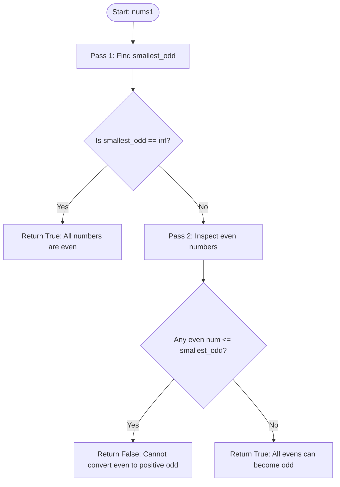

<h2><a href="https://leetcode.com/problems/construct-uniform-parity-array-ii">3876. Construct Uniform Parity Array II</a></h2>

<p>You are given an array <code>nums1</code> of <code>n</code> <strong>distinct</strong> integers.</p>

<p>You want to construct another array <code>nums2</code> of length <code>n</code> such that the elements in <code>nums2</code> are either <strong>all odd or all even</strong>.</p>

<p>For each index <code>i</code>, you must choose <strong>exactly one</strong> of the following (in any order):</p>

<ul>
	<li><code>nums2[i] = nums1[i]</code>​​​​​​​</li>
	<li><code>nums2[i] = nums1[i] - nums1[j]</code>, for an index <code>j != i</code>, such that <code>nums1[i] - nums1[j] &gt;= 1</code></li>
</ul>

<p>Return <code>true</code> if it is possible to construct such an array, otherwise return <code>false</code>.</p>

<p>&nbsp;</p>
<p><strong class="example">Example 1:</strong></p>

<div class="example-block">
<p><strong>Input:</strong> <span class="example-io">nums1 = [1,4,7]</span></p>

<p><strong>Output:</strong> <span class="example-io">true</span></p>

<p><strong>Explanation:</strong>​​​​​​​​​​​​​​</p>

<ul>
	<li>Set <code>nums2[0] = nums1[0] = 1</code>.</li>
	<li>Set <code>nums2[1] = nums1[1] - nums1[0] = 4 - 1 = 3</code>.</li>
	<li>Set <code>nums2[2] = nums1[2] = 7</code>.</li>
	<li><code>nums2 = [1, 3, 7]</code>, and all elements are odd. Thus, the answer is <code>true</code>.</li>
</ul>
</div>

<p><strong class="example">Example 2:</strong></p>

<div class="example-block">
<p><strong>Input:</strong> <span class="example-io">nums1 = [2,3]</span></p>

<p><strong>Output:</strong> <span class="example-io">false</span></p>

<p><strong>Explanation:</strong></p>

<p>It is not possible to construct <code>nums2</code> such that all elements have the same parity. Thus, the answer is <code>false</code>.</p>
</div>

<p><strong class="example">Example 3:</strong></p>

<div class="example-block">
<p><strong>Input:</strong> <span class="example-io">nums1 = [4,6]</span></p>

<p><strong>Output:</strong> <span class="example-io">true</span></p>

<p><strong>Explanation:</strong></p>

<ul>
	<li>Set <code>nums2[0] = nums1[0] = 4</code>.</li>
	<li>Set <code>nums2[1] = nums1[1] = 6</code>.</li>
	<li><code>nums2 = [4, 6]</code>, and all elements are even. Thus, the answer is <code>true</code>.</li>
</ul>
</div>

<p>&nbsp;</p>
<p><strong>Constraints:</strong></p>

<ul>
	<li><code>1 &lt;= n == nums1.length &lt;= 10<sup>5</sup></code></li>
	<li><code>1 &lt;= nums1[i] &lt;= 10<sup>9</sup></code></li>
	<li><code>nums1</code> consists of distinct integers.</li>
</ul>


---

# 🛍️ Construct-Uniform-Parity-Array-II | Explained

## Approach 1: Smallest Odd Element Greedy Validation

### Intuition
The problem asks whether we can construct an array where every element has the same parity (all even or all odd) using valid subtraction rules: any element $x$ can either remain as $x$ or become $x - y$, where $y$ is an element from the array and $x - y > 0$.

Think of this like currency exchange with specific parity rules:
- **Even $-$ Even = Even**
- **Odd $-$ Odd = Even**
- **Even $-$ Odd = Odd**
- **Odd $-$ Even = Odd**

1. **Can we make everything even?**
   - An even number is already even.
   - An odd number can only become even by subtracting another odd number ($Odd - Odd = Even$).
   - However, subtraction requires $x - y > 0$, meaning $x > y$. The absolute smallest odd number in the entire array has no strictly smaller odd number available to subtract from it. Therefore, the minimum odd element can **never** become even.
   - Conclusion: We can make all elements even **if and only if** there are no odd numbers in the array to begin with.

2. **Can we make everything odd?**
   - An odd number is already odd.
   - An even number can only become odd by subtracting an odd number ($Even - Odd = Odd$).
   - To satisfy $x - y > 0$, an even number $x$ must find an odd number $y$ such that $x > y$.
   - The easiest odd number to satisfy this condition is the **minimum odd number** in the array (`smallest_odd`). If an even number $x \le smallest\_odd$, it cannot subtract any odd number from the array and remain strictly positive ($> 0$).
   - Conclusion: If an odd number exists, we can make all elements odd **if and only if** every even number is strictly greater than `smallest_odd`.

### Algorithm Visualized



### Approach
1. **Pass 1 (Identify Parity & Track Minimum Odd):**
   - Initialize `smallest_odd` to infinity (`float('inf')`).
   - Iterate through `nums1`. If an element is odd (`num % 2 == 1`), update `smallest_odd = min(smallest_odd, num)`.
2. **Handle Pure Even Case:**
   - If `smallest_odd` is still infinity, no odd numbers exist in the array. Every number is already even, so uniform parity (all even) is trivially achievable. Return `True`.
3. **Pass 2 (Validate Even Elements Against Minimum Odd):**
   - Because at least one odd element exists, the array can never be made uniformly even (the smallest odd number cannot be converted). We must attempt to make the entire array uniformly odd.
   - Iterate through `nums1`. For every even number (`num % 2 == 0`), check if `num <= smallest_odd`.
   - If any even number is less than or equal to `smallest_odd`, it cannot subtract any available odd number to remain positive. Return `False`.
   - If all even numbers are strictly greater than `smallest_odd`, each can be transformed into a positive odd number by subtracting `smallest_odd`. Return `True`.

### Detailed Code Analysis

- **`smallest_odd = float('inf')`**:
  Initializes a tracking variable to store the lowest value among all odd integers encountered. Using `float('inf')` guarantees that any integer in `nums1` will be smaller upon comparison.

- **`for num in nums1: if num % 2 == 1: smallest_odd = min(smallest_odd, num)`**:
  Performs the first linear scan. Using the modulo operator `num % 2 == 1`, it filters for odd elements and maintains the minimum odd element observed so far.

- **`if smallest_odd == float('inf'): return True`**:
  Checks the sentinel value. If `smallest_odd` was never reassigned, the array contains strictly even numbers. Since all elements already have identical parity (even), the condition is satisfied immediately, bypassing unnecessary second scans.

- **`for num in nums1: if num % 2 == 0 and num <= smallest_odd: return False`**:
  Performs the validation pass. Because at least one odd number exists, our only viable configuration is an all-odd array. Every even number requires an odd number strictly smaller than itself to perform `even - odd = odd > 0`. If any even number satisfies `num <= smallest_odd`, no such odd number exists in the array for that element, making conversion impossible and triggering an early exit with `False`.

- **`return True`** *(Syntactic Completion)*:
  If the loop finishes without finding any conflicting even elements, every even element is strictly greater than `smallest_odd` and can be converted into a valid positive odd number ($num - smallest\_odd$). Thus, uniform odd parity is guaranteed.

### Code

```python
class Solution:
    def uniformArray(self, nums1: list[int]) -> bool:
        smallest_odd = float('inf')
        
        # Pass 1: Find the smallest odd number in nums1
        for num in nums1:
            if num % 2 == 1:
                smallest_odd = min(smallest_odd, num)
        
        # If there are no odd numbers, all elements are already even
        if smallest_odd == float('inf'):
            return True
            
        # Pass 2: Verify if any even number cannot be converted to a positive odd number
        for num in nums1:
            if num % 2 == 0 and num <= smallest_odd:
                return False
                
        return True
```

### Complexity
- **Time:** $\mathcal{O}(n)$, where $n$ is the length of `nums1`. The algorithm performs two independent linear traversals over the input list: the first to determine `smallest_odd` and the second to validate even values. Each operation inside the loops (modulo, comparison, assignment) executes in $\mathcal{O}(1)$ time.
- **Space:** $\mathcal{O}(1)$ auxiliary space. The algorithm only uses a single primitive variable (`smallest_odd`) to track the minimum odd value without allocating additional memory proportional to the input size.

---

## 🕵️‍♂️ Follow-up Questions

1. **Can this problem be solved in a single pass instead of two passes?**
   - **Answer:** Yes. Track both `min_all` (minimum of all elements) and `min_odd` (minimum of odd elements) in a single pass. If the global minimum element of the entire array is odd (`min_all % 2 == 1`), then by definition, every even element must be strictly greater than this odd element, which guarantees that all evens can be converted. If the global minimum is even, uniform parity is possible only if there are no odd elements at all. Thus, the condition reduces to: `min_all % 2 == 1 or min_odd == float('inf')`.

2. **How would the constraints change if numbers could be negative or zero?**
   - **Answer:** If non-positive values are allowed, the constraint $x - y > 0$ alters behavior. A negative or zero result might be permissible depending on the problem statement. Furthermore, modulo behavior on negative numbers in Python (`-3 % 2 == 1`) differs from languages like C++/Java (`-3 % 2 == -1`), requiring bitwise parity checks like `(num & 1) != 0` to prevent parity misclassifications.